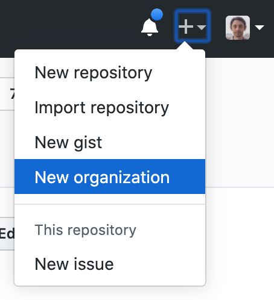
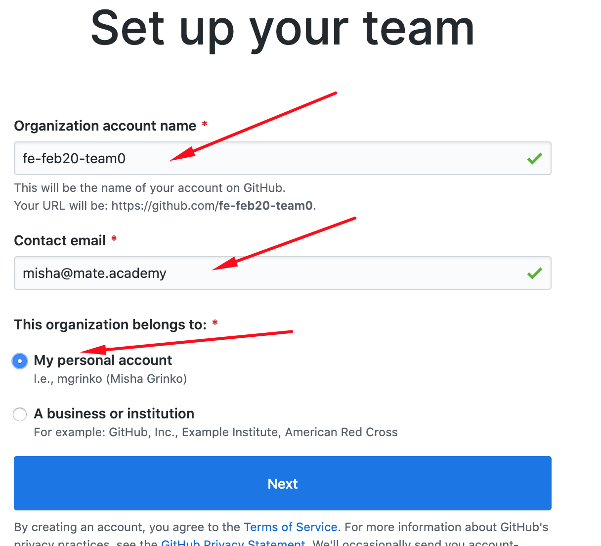
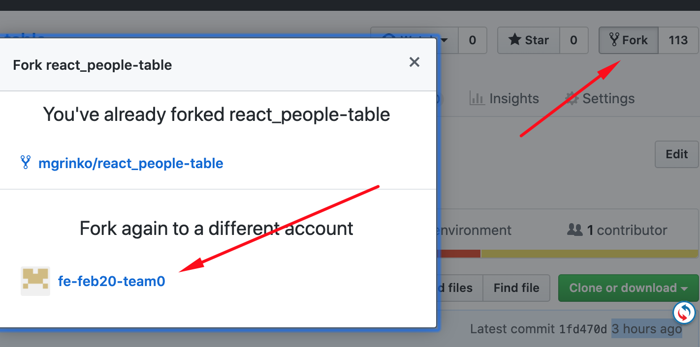

# How to work in a team
1. Create an organization on Github 
1. Choose a `Free` plan
1. Use a name like `fe-feb20-team0` (your group + your team name)
1. It should belong to your personal account 
1. Add your teammate to the team by his/her username on Github 
1. Fork the task repo to your organization 
1. Clone the repo from your organization
1. Create a `develop` branch to have it as a base for your feature PullRequests
1. Push `develop` to github

## How to develop a feature
1. `Pull` the latest `develop`
1. Create a `feat/your-feature-name` branch and `push` it to Github
1. Open a Pull Request (`PR`) from your branch to `develop`
1. Add a [DEMO LINK](https://<your_account>.github.io/react_phone-catalog/) to the PR description
1. Write your code, save it and push it to Github
1. Deploy the code to GH-Pages
1. Ask your teammate to review and approve if everything is OK
1. If some fixes are required discuss the comments and repeat steps 4-6
1. If PR was approved by your teammate ask a mentor to review
1. If the mentor requests some changes repeat steps 4-5
1. After the mentor approves your PR `merge` it and delete the feature branch
